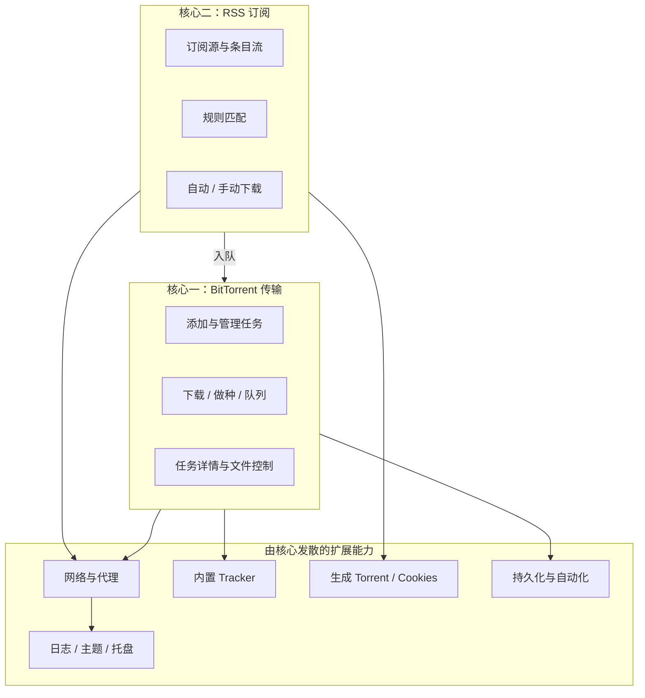

# TorrentLink 功能介绍

> 本文从 **两大核心功能** 出发，再向外介绍与之关联的扩展能力。  
> 英文概览见 [README.md](../README.md)；构建说明见 [READEME_zh.md](../READEME_zh.md)。

---

## 产品定位

**TorrentLink** 是基于 **Qt 6 + libtorrent 2.0** 的桌面 BitTorrent 客户端，UI 部分参考 qBittorrent。

整个应用围绕两条主线组织：

主窗口只有两个顶层标签页，与两大核心一一对应：**传输**、**RSS 订阅**。  
支持 **Linux / Windows**（macOS 暂不支持）。

---

# 核心一：BitTorrent 传输

> **入口：** 主窗口 **传输** 标签  
> **本质：** 通过 libtorrent 会话完成 P2P 下载、做种与任务生命周期管理。

## 1.1 添加任务

一切传输能力始于「把资源加入会话」。

| 方式 | 入口 |
|------|------|
| Torrent 文件 | **文件 → 打开 Torrent 文件** |
| 磁力 / 链接 | **文件 → 打开 Torrent 链接**（支持多行批量） |
| 命令行 | 启动参数传入磁力链接 |
| 来自 RSS | RSS 规则命中或条目流手动下载（见核心二） |

弹出 **添加 Torrent** 对话框时可配置：

- 保存路径、不完整文件单独路径
- 分类、标签（逗号分隔）
- 内容布局：原始 / 创建子文件夹 / 不创建子文件夹
- 是否立即开始、停止条件、按顺序下载、先下首尾块、跳过校验、加入队列顶部
- 按文件勾选下载与否及优先级

相同 info-hash 重复添加会被忽略并提示。

## 1.2 任务列表与筛选

**15 列信息：** 名称、状态、进度、已下载、下载/上传速度、选定大小、做种数、用户、剩余时间、比率、分类、标签、可用性、错误信息。

- 支持多选、**Ctrl+A** 全选、按列排序
- 左侧 **状态列表** 快速筛选：全部 / 下载 / 做种 / 完成 / 暂停 / 错误，以及「更多…」下的检查中、活动、空闲等细分状态

## 1.3 任务控制（右键菜单）

在列表中右键（可多选批量）：

| 方向 | 能力 |
|------|------|
| 启停 | 启动、停止、强制启动、移除（可选删本地文件） |
| 队列 | 移到顶/上/下/底 |
| 元数据 | 重命名、移动保存位置、编辑 Tracker、分类与标签 |
| 下载策略 | 顺序下载、先下首尾块、强制重新检查、强制重新汇报 |
| 信息 | 复制名称 / hash / 磁力 / 注释，打开目标文件夹 |

## 1.4 任务详情面板

**视图 → 显示传输页任务详情** 打开底部详情区。选中任务后，六个 Tab 从不同维度观察同一传输任务：

| Tab | 作用 |
|-----|------|
| **普通** | 进度、速率、分享率、ETA、连接数、info-hash、保存路径等汇总 |
| **Tracker** | Tracker URL、DHT/PeX/LSD 状态、announce 消息与倒计时；可增删改 Tracker |
| **用户** | 当前 Peers：IP、客户端、进度、上下行速率 |
| **HTTP 源** | Web Seed（BEP17 / BEP19），配合 HTTP 补源下载 |
| **内容** | 文件树：优先级、进度、可用性；可重命名、设优先级、打开文件 |
| **速度** | 该任务的下载/上传速度曲线 |

详情面板是「传输核心」的显微镜——排查 Tracker 失败、选文件、看 Peer 质量都依赖它。

## 1.5 做种与队列（从传输发散）

与「下完以后怎么办、同时跑几个任务」相关，配置在 **工具 → 首选项**：

| 位置 | 内容 |
|------|------|
| **任务** Tab | 默认下载目录；做种策略（无限做种 / 目标分享率 / 时长上限） |
| **连接** Tab | 活跃下载/做种/总上限、单任务连接数、上传窗口、监听端口 |
| **系统** Tab | 默认 Tracker 列表（新任务自动附加）；任务自动保存间隔；恢复时默认暂停 |

做种达到分享率或时长上限后，应用层会自动停止该任务做种。

## 1.6 传输相关的网络能力（从传输发散）

BitTorrent 会话的网络选项在 **首选项 → 连接**：

- **限速：** 全局下载/上传 KiB/s
- **端口：** 指定监听端口或随机；UPnP / NAT-PMP 端口转发
- **发现：** DHT、LSD 可独立开关
- **加密：** 启用（兼容）/ 强制 / 禁用
- **IP 过滤：** 文本规则文件，变更后热重载，作用于 Peer 连接
- **代理：** SOCKS5 / HTTP（见下文「共享网络层」）

底部 **状态栏**（视图可开关）显示 DHT 节点数与全局 ↓↑ 速率。

---

# 核心二：RSS 订阅与自动下载

> **入口：** 主窗口 **RSS 订阅** 标签  
> **本质：** 定时拉取 Feed → 匹配规则 → 将磁力或 `.torrent` URL **送入传输队列**。

RSS 不是独立下载器，而是 **传输核心的自动化前端**。

## 2.1 三层页面结构

| 子页 | 职责 |
|------|------|
| **订阅源** | 管理 Feed URL：添加、刷新、启用/暂停、OPML 导入导出 |
| **条目流** | 浏览所有条目：搜索、手动下载、复制链接、播放、忽略 |
| **自动规则** | 定义「什么标题该下」：关键词/正则、保存路径、分类标签 |

## 2.2 订阅源

- 表格展示：名称、URL、状态、刷新时间、自动下载开关、错误信息
- 右键：单源刷新、编辑、开关自动下载、清空本地条目、删除等
- **OPML** 批量迁移订阅列表

## 2.3 条目流

列信息：标题、来源、时间、资源类型（磁力/种子）、规则命中、**自动下载诊断**、下载状态、**关联任务进度**。

常用操作：

- **下载选中** — 与自动下载共用同一套入队逻辑
- **复制链接**、**打开文件夹**、**播放**（外部播放器）
- **全部刷新** — 对已启用订阅重新拉取条目

右侧详情区展示摘要及已关联传输任务的状态。

## 2.4 自动规则

| 字段 | 说明 |
|------|------|
| 订阅源范围 | 留空 = 全部；或指定若干订阅源 ID |
| 包含词 / 排除词 | 逗号分隔；可勾选 **正则** |
| 保存路径 / 分类 / 标签 | 命中后写入新传输任务的元数据 |

## 2.5 自动下载如何生效

需 **三层开关同时打开**：

1. **首选项 → 内容**：全局自动下载总开关  
2. **订阅源页**：该 Feed 开启自动下载  
3. **自动规则页**：存在已启用且匹配的规则  

并发由首选项限制：每次刷新最大下载数、同时自动下载数、排队上限。  
支持磁力与远程 `.torrent` URL；下载结束后 **结算** 回写条目状态（已下载 / 失败原因等）。

## 2.6 RSS 相关配置（从 RSS 发散）

**首选项 → 内容** Tab：

- 自动下载与刷新间隔
- 历史条目数量、保留天数
- 外部播放器命令（如 `mpv`）
- **HTTP 请求头：** User-Agent、Accept-Language、Cookie

**工具 → 管理 Cookies** 提供更直观的 Cookie 表格编辑，保存后供 RSS HTTP 使用。

RSS 与 `.torrent` 链接下载可走 **首选项 → 连接** 中的代理（与 BT 会话共用配置项）。

---

# 两大核心的交汇

| 场景 | 路径 |
|------|------|
| RSS 自动下完 | 条目流「任务进度」列 ↔ 传输页同一任务 |
| RSS 手动下载 | 条目流「下载选中」→ 弹出或跳过添加对话框 → 传输列表 |
| 分类 / 标签 | 规则写入 → 传输列表「分类」「标签」列可见 |
| 保存路径 | RSS 规则路径 → 否则默认下载目录（首选项 → 任务） |

理解这一点有助于排查问题：RSS 显示「失败」时，往往要到 **传输页** 或 **任务详情** 看 libtorrent 侧错误。

---

# 由核心发散的扩展功能

以下能力不属于单独的主标签页，但分别服务于传输、RSS 或整体体验。

## 3.1 共享网络层

**首选项 → 连接 → 代理与 IP 过滤**

| 能力 | 作用范围 |
|------|----------|
| SOCKS5 / HTTP 代理 | BitTorrent 会话 + RSS 拉取 + RSS 内 `.torrent` 下载 |
| IP 过滤（文本文件） | libtorrent Peer 连接 |
| 关闭显式代理时 | HTTP 可能跟随系统环境变量（如 `http_proxy`） |

**不走代理：** 内置 Tracker、本地打开 `.torrent` 文件。

## 3.2 内置 HTTP Tracker（实验性）

从 **传输 / 做种** 场景发散：本机可充当 Tracker，方便局域网或自测。

**首选项 → 连接 → 发现与端口映射：**

- 启用嵌入式 BEP3 `GET /announce`
- 绑定 **仅本机** 或 **局域网**
- 保存后在日志搜 `[builtin-tracker]` 获取 announce URL

限制：IPv6 不支持；UPnP/NAT-PMP 端口映射 **尚未实现**。

## 3.3 生成 Torrent

从 **传输** 反向扩展：自制种子再交给传输核心下载/做种。

**工具 → 生成 Torrent：** 选文件/目录、分块大小、Tracker 与 Web Seed URL、私有标记、注释；可配合 HTTP 源 Tab 测试 Web Seed。

## 3.4 日志与诊断

| 入口 | 用途 |
|------|------|
| 视图 → 显示日志面板 | 主窗口内嵌滚动日志 |
| 工具 → 日志中心 | 级别过滤、关键字搜索、导出、打开日志目录 |

**首选项 → 系统：** 日志落盘、级别、按大小轮转。  
Tracker、RSS 刷新、内置 Tracker 启动等信息均写入日志，是跨核心的排错入口。

## 3.5 界面与交互

- **工具 → 界面主题：** 浅色 / 深色 / 跟随系统
- **视图：** 日志面板、底部状态栏、任务详情、刷新列表
- **帮助 → 使用说明 / 关于**

## 3.6 系统托盘与生命周期

**首选项 → 系统 → 窗口行为：** 关闭时最小化到托盘或退出；启动时最小化。

托盘：显示窗口、暂停/继续全部、退出；任务完成可弹通知。

**持久化（支撑两大核心重启后续传）：**

| 数据 | 位置 |
|------|------|
| 任务列表 | `{配置目录}/tasks.json` |
| 会话恢复 | `{数据目录}/resume/*.rd` |
| RSS | `{配置目录}/rss/*.json` |
| 应用设置 | `{配置目录}/app.ini` |

**自动化：**

- 定时动作：N 分钟后退出或关机
- 全部任务下载完成后：退出 / 睡眠 / 休眠 / 关机（与定时动作互斥）

---

# 尚未挂载或规划中的能力

与核心相关但 **当前不完整** 的项：

| 项目 | 说明 |
|------|------|
| 在线全站搜索 | 代码有 `SearchTab`（本地历史 / RSS / 全站），主界面 Tab **未挂载**；全站未实现 |
| 内置 Tracker 端口映射 | 设置项存在，UPnP/NAT-PMP 未实现 |
| IP 过滤扩展 | eMule dat、右键封禁 IP 等未实现 |
| 远程 Web UI | 未实现 |
| macOS | 不支持 |

完整 Backlog 见 [READEME_zh.md](../READEME_zh.md) 的 **V2 Backlog**。

---

# 快速上手（沿两大核心）

### 只用传输核心

1. **文件 → 打开 Torrent 链接**，粘贴磁力链接  
2. 确认保存路径 → 在 **传输** 页看进度  
3. **视图 → 显示传输页任务详情** → 按需查看 Tracker / 内容 / 速度  

### 传输 + RSS 联动

1. **RSS 订阅 → 订阅源**：添加 Feed，开启自动下载  
2. **RSS 订阅 → 自动规则**：写包含/排除关键词  
3. **首选项 → 内容**：打开全局自动下载，设刷新间隔  
4. **条目流** 看诊断列；已入队条目在 **传输** 页看进度  

### 局域网做种（扩展）

1. **首选项 → 连接**：启用内置 Tracker，绑定「局域网」  
2. **工具 → 生成 Torrent**，Tracker 填日志中的 announce URL  
3. 把种子发给同网段设备，对方用 **传输核心** 添加即可  

---

# 文档说明

- 内容以当前源码与菜单为准；若入口变更请同步更新本文  
- 问题反馈见 README 中的 GitHub Issue 或联系邮箱  

*TorrentLink — 以 BitTorrent 传输与 RSS 自动化为双核心的桌面下载器*
